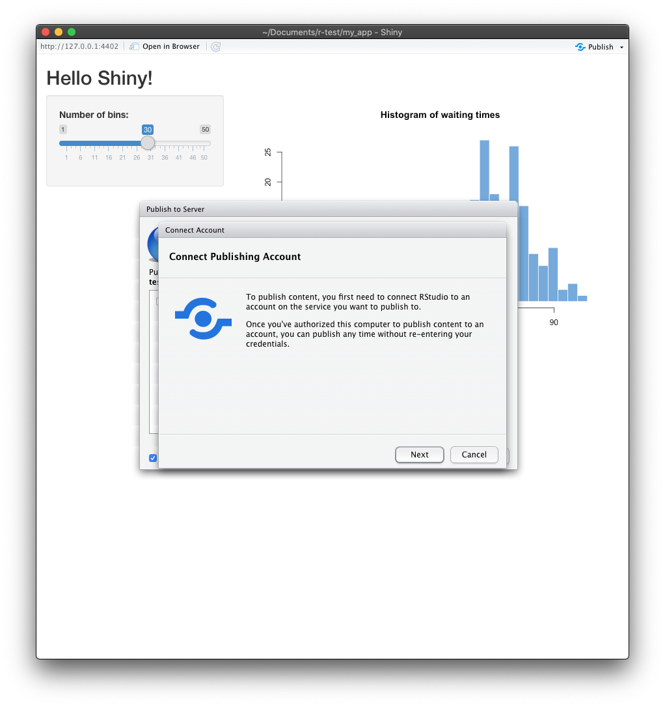
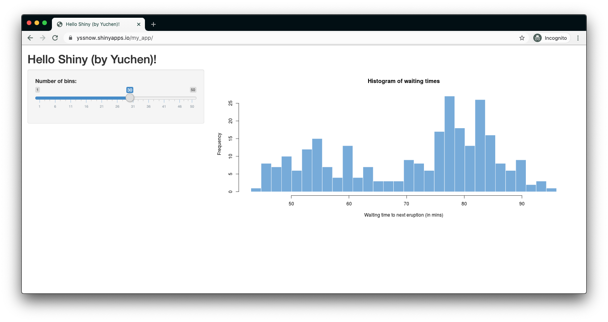

# R Demo App

Deployment screenshot:



Result screenshot:


# Deployment to Aliyun

Operating System: CentOS 7.6

[Download Shiny Server for Red Hat/CentOS 6+](https://rstudio.com/products/shiny/download-server/redhat-centos/)
[Shiny Server Professional v1.5.14 Administrator's Guide](https://docs.rstudio.com/shiny-server/)


```
# sodu yum install git
# git --version
git version 1.8.3.1
```

[How to Deploy Interactive R Apps with Shiny Server](https://www.linode.com/docs/development/r/how-to-deploy-rshiny-server-on-ubuntu-and-debian/#deploy-your-app)

## Checking Error

After installation with the above, and visit http://118.190.211.210:3838/my_app/.
```
An error has occurred
The application failed to start.

The application exited during initialization.
```

```
ls 
```

https://stackoverflow.com/questions/36817796/error-in-libraryshiny-there-is-no-package-called-shiny-on-windows

## Running R session in Terminal

```
$ R
> install.packages("shiny")
> install.packages("httpuv")
```

or

```
$ R
> install.packages("shiny", repo="https://mirrors.tuna.tsinghua.edu.cn/CRAN/")
> install.packages("httpuv", repo="https://mirrors.tuna.tsinghua.edu.cn/CRAN/")
```

[so](https://stackoverflow.com/questions/58107164/can-i-use-r-without-r-studio)


## Error Installing Shiny

```
{standard input}: Assembler messages:
{standard input}:21309: Warning: end of file not at end of a line; newline inserted
{standard input}:22141: Error: no such instruction: `c'
{standard input}:22141: Error: open CFI at the end of file; missing .cfi_endproc directive
```

Try:

```
update.packages(checkBuilt = TRUE, ask = FALSE)
```

[reference](https://groups.google.com/g/shiny-discuss/c/HSY6YvHAw3U?pli=1)

Try update gcc:

[How to Install GCC Compiler on CentOS 7](https://linuxize.com/post/how-to-install-gcc-compiler-on-centos-7/)


[reference](https://medium.com/@bipul.k.kuri/install-latest-gcc-on-centos-linux-release-7-6-a704a11d943d)

```
[root@iZm5egl1v0fez8ou4k5396Z my_app]# gcc --version
gcc (GCC) 4.8.5 20150623 (Red Hat 4.8.5-39)
Copyright (C) 2015 Free Software Foundation, Inc.
This is free software; see the source for copying conditions.  There is NO
warranty; not even for MERCHANTABILITY or FITNESS FOR A PARTICULAR PURPOSE.
```

Try install it seperatly:

```
wget http://cran.r-project.org/src/contrib/httpuv_1.5.4.tar.gz
```

Try no lock:

```
install.packages("Rcpp", dependencies = TRUE, INSTALL_opts = '--no-lock')
install.packages("httpuv", dependencies = TRUE, INSTALL_opts = '--no-lock')
```

https://stackoverflow.com/questions/14382209/r-install-packages-returns-failed-to-create-lock-directory

Try:

```
yum install libuv-devel
```

https://stackoverflow.com/questions/50301764/on-centos-linux-7-4-cannot-install-the-r-package-httpuv

# Error

```
tools/version.c:1:10: fatal error: openssl/opensslv.h: No such file or directory
```

sodu yum install python-pip python-dev libffi-dev libssl-dev libxml2-dev libxslt1-dev libjpeg8-dev zlib1g-dev


Try dev tools?

```
install.packages("devtools")
```

https://github.com/rstudio/shiny/issues/2073#issuecomment-433831825


The above failed:

```
sudo yum -y install libcurl libcurl-devel
```

https://stackoverflow.com/a/26938115/1035008


```
* installing *source* package ‘httpuv’ ...
** package ‘httpuv’ successfully unpacked and MD5 sums checked
** using staged installation
** libs
g++ -m64 -std=gnu++11 -I"/usr/include/R" -DNDEBUG -Ilibuv/include -pthread -I"/usr/lib64/R/library/Rcpp/include" -I"/usr/lib64/R/library/BH/include" -I"/usr/lib64/R/library/later/include" -I/usr/local/include -fvisibility=hidden -DSTRICT_R_HEADERS -fpic  -O2 -g -pipe -Wall -Wp,-D_FORTIFY_SOURCE=2 -fexceptions -fstack-protector-strong --param=ssp-buffer-size=4 -grecord-gcc-switches   -m64 -mtune=generic  -c RcppExports-legacy.cpp -o RcppExports-legacy.o
g++: internal compiler error: Killed (program cc1plus)
Please submit a full bug report,
with preprocessed source if appropriate.
See <http://bugzilla.redhat.com/bugzilla> for instructions.
make: *** [/usr/lib64/R/etc/Makeconf:174: RcppExports-legacy.o] Error 4
ERROR: compilation failed for package ‘httpuv’
* removing ‘/root/R/x86_64-redhat-linux-gnu-library/3.6/httpuv’

The downloaded source packages are in
        ‘/tmp/RtmpKOYozc/downloaded_packages’
Warning message:
In install.packages("httpuv") :
  installation of package ‘httpuv’ had non-zero exit status
```

Try

```
install.packages('Rcpp')
```

There are permission problem?

This works:

https://github.com/r-lib/later/issues/65#issuecomment-412031584

```
update.packages(ask=FALSE)
```


# Docker Test
Start a centos image

```
docker run -i -t centos
```

https://osric.com/chris/accidental-developer/2017/08/running-centos-in-a-docker-container/


```
yum install git
```

# Let's start over with a Ubuntu instance

https://docs.rstudio.com/shiny-server/#ubuntu-14.04

```
sudo apt-get update
sudo apt-get install r-base
sudo apt-get install r-base-dev
sudo apt-get install gdebi-core
sudo gdebi shiny-server-v1.5.14.deb
```

Put this under `~/.Rprofile`:

```
options(download.file.method = "libcurl")
local({
  r <- getOption("repos")
  r["CRAN"] <- "https://cran.rstudio.com/"
  options(repos=r)
})
```

```
sudo su - -c "R -e \"install.packages('shiny')\""
```

Looking good after bumping memory to 2G.

```
> install.packages('shiny')
Installing package into ‘/usr/local/lib/R/site-library’
(as ‘lib’ is unspecified)
trying URL 'https://cran.rstudio.com/src/contrib/shiny_1.5.0.tar.gz'
Content type 'application/x-gzip' length 3472148 bytes (3.3 MB)
==================================================
downloaded 3.3 MB

* installing *source* package ‘shiny’ ...
** package ‘shiny’ successfully unpacked and MD5 sums checked
** using staged installation
** R
** inst
** byte-compile and prepare package for lazy loading
** help
*** installing help indices
*** copying figures
** building package indices
** testing if installed package can be loaded from temporary location
** testing if installed package can be loaded from final location
** testing if installed package keeps a record of temporary installation path
* DONE (shiny)

The downloaded source packages are in
        ‘/tmp/RtmpZzCttF/downloaded_packages’
```

Continue

https://rstudio.com/products/shiny/download-server/ubuntu/

```
# wget https://download3.rstudio.org/ubuntu-14.04/x86_64/shiny-server-1.5.14.948-amd64.deb
# sudo gdebi shiny-server-1.5.14.948-amd64.deb
# sudo gdebi shiny-server-1.5.14.948-amd64.deb

Reading package lists... Done
Building dependency tree        
Reading state information... Done
Reading state information... Done

Shiny Server
 Shiny Server is a server program from RStudio, Inc. that makes Shiny applications available over the web. Shiny is a web application framework for the R statistical computation language.
Do you want to install the software package? [y/N]:y
/usr/bin/gdebi:113: FutureWarning: Possible nested set at position 1
  c = findall("[[(](\S+)/\S+[])]", msg)[0].lower()
Selecting previously unselected package shiny-server.
(Reading database ... 118173 files and directories currently installed.)
Preparing to unpack shiny-server-1.5.14.948-amd64.deb ...
Unpacking shiny-server (1.5.14.948) ...
Setting up shiny-server (1.5.14.948) ...
Creating user shiny
Adding LANG to /etc/systemd/system/shiny-server.service, setting to en_US.UTF-8
Created symlink /etc/systemd/system/multi-user.target.wants/shiny-server.service → /etc/systemd/system/shiny-server.service.
● shiny-server.service - ShinyServer
     Loaded: loaded (/etc/systemd/system/shiny-server.service; enabled; vendor preset: enabled)
     Active: active (running) since Fri 2020-08-28 10:59:36 CST; 17ms ago
   Main PID: 17541 (shiny-server)
      Tasks: 1 (limit: 2319)
     Memory: 104.0K
     CGroup: /system.slice/shiny-server.service
             └─17541 /opt/shiny-server/ext/node/bin/shiny-server /opt/shiny-server/lib/main.js

Aug 28 10:59:36 iZ0xi1qg6uo38rzjvyo35eZ systemd[1]: Started ShinyServer.
```

管理》 本实例安全组 》 安全组列表》手动添加》目的3838》搜去俺对象 `0.0.0.0/0`


cd /srv/shiny-server
